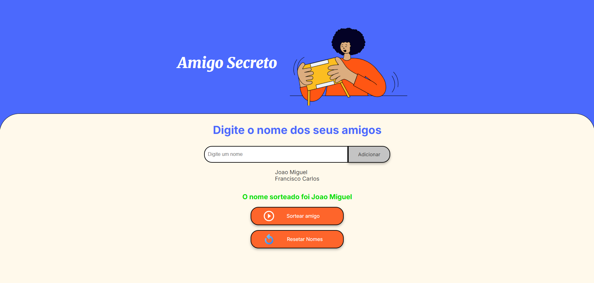

# 🎁 Projeto Amigo Secreto

Um projeto simples e funcional de sorteio de **Amigo Secreto**, desenvolvido com HTML, CSS e JavaScript puro. A aplicação permite adicionar nomes, realizar sorteios aleatórios e resetar a lista de participantes de forma interativa e responsiva.

---

## 📸 Demonstração

---

## 🧩 Funcionalidades

- ✅ Adicionar nomes à lista de participantes
- ✅ Exibir lista de amigos dinamicamente
- ✅ Sortear aleatoriamente um nome e exibir o resultado
- ✅ Resetar lista e limpar resultados com um botão
  
---

## 🚀 Tecnologias Utilizadas

- HTML5
- CSS3
- JavaScript (ES6+)
- Google Fonts

---
